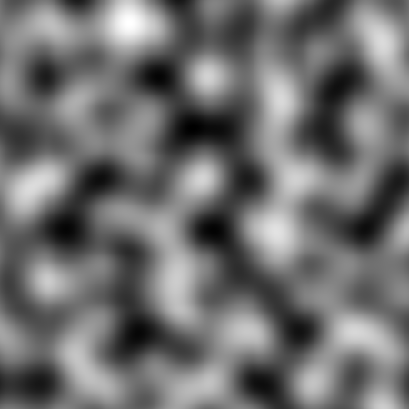
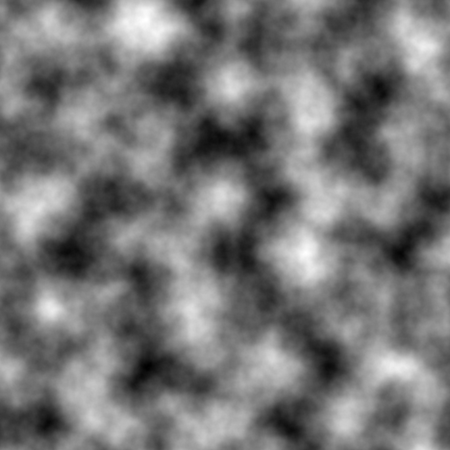
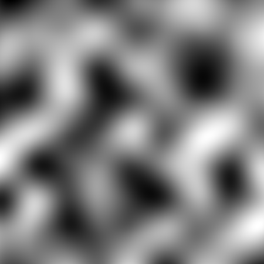
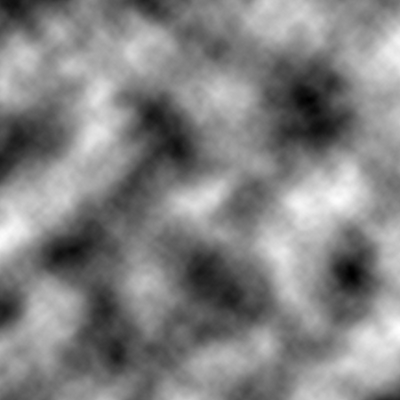
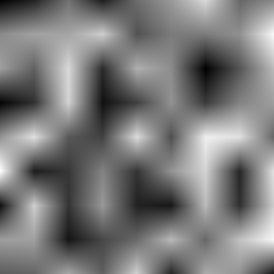
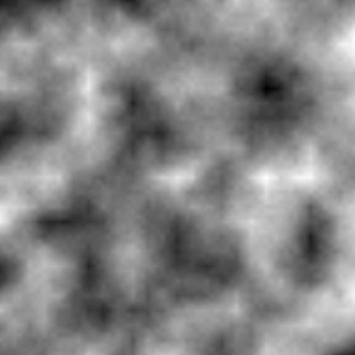
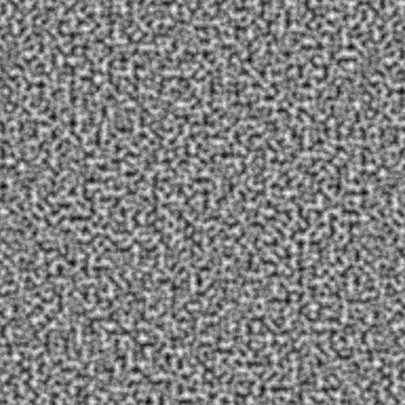
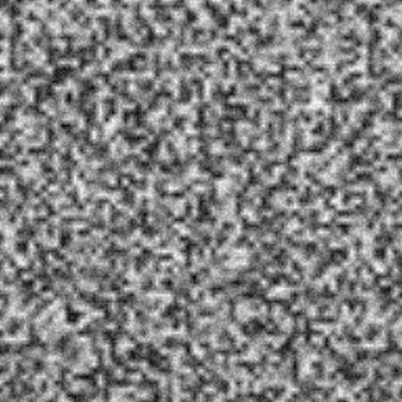
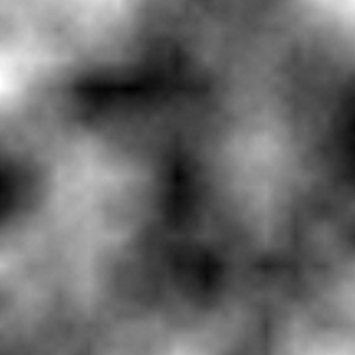

# Coherent Noise Visualizer

A project I made to visualize coherent noise.

## Video Demo 

VIDEO DEMO HERE

## Rendered Pictures

  
Perlin Hermite

  
Perlin Hermite Octave

  
Value Cubic

  
Value Cubic Octave

  
Value Linear

  
Value Linear Octave

  
Perlin Hermite Octave (high sample interval)

  
Value Linear Octave (high sample interval)

  
Value Linear Octave (very low sample interval)

## Credit

These are some of the resources I used to understand coherent noise:
 - [The Perlin noise math FAQ](https://web.archive.org/web/20101124044214/http://webstaff.itn.liu.se/~stegu/TNM022-2005/perlinnoiselinks/perlin-noise-math-faq.html) by Matt Zucker.
 - [Perlin Noise](https://web.archive.org/web/20101123005335/http://freespace.virgin.net/hugo.elias/models/m_perlin.htm) by Hugo Elias.
 - [Lectures](https://ocw.mit.edu/courses/6-837-computer-graphics-fall-2012/resources/mit6_837f12_lec16/) from a MIT computer graphics course.
- 3D Computer Graphics by Samuel R. Buss.